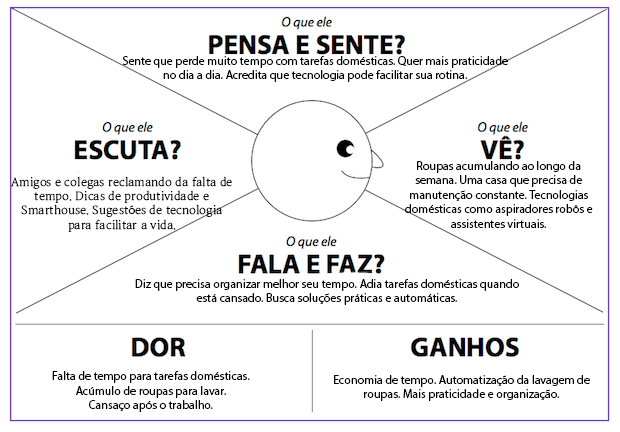
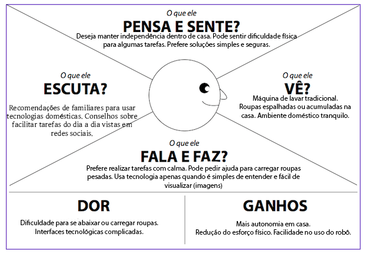
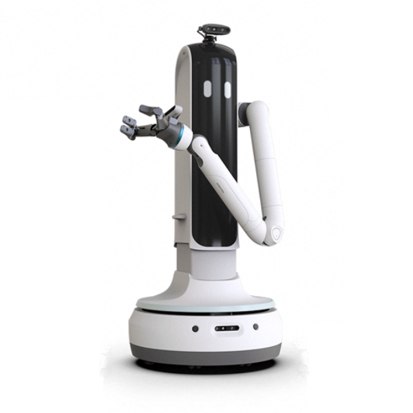
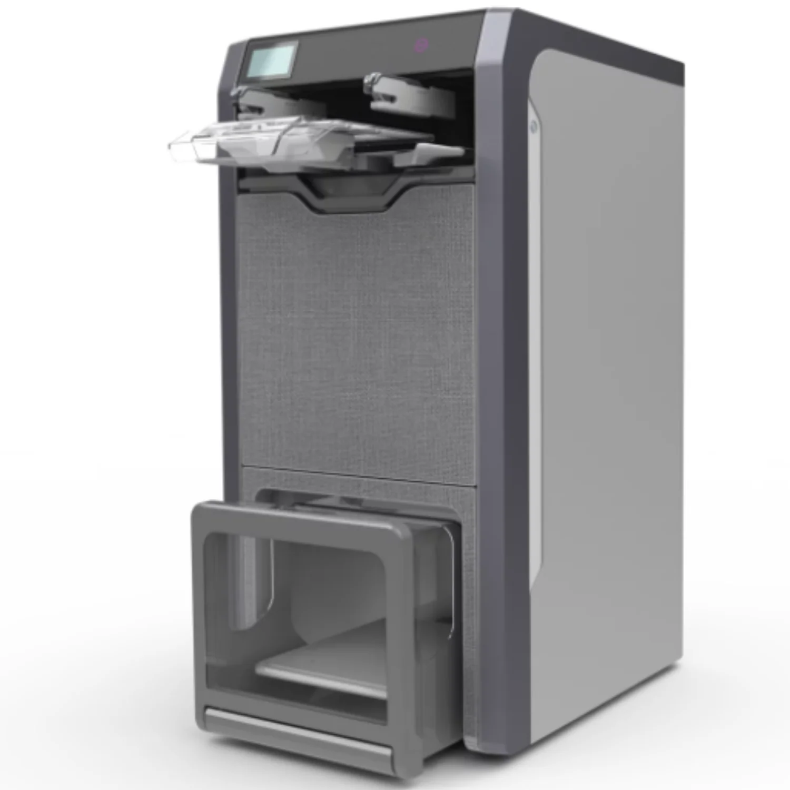
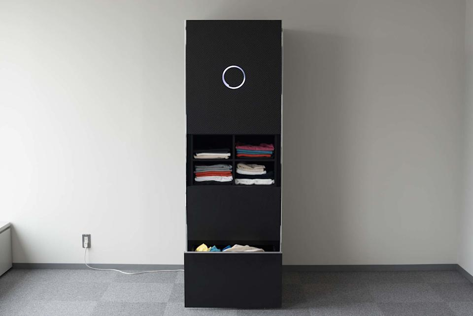
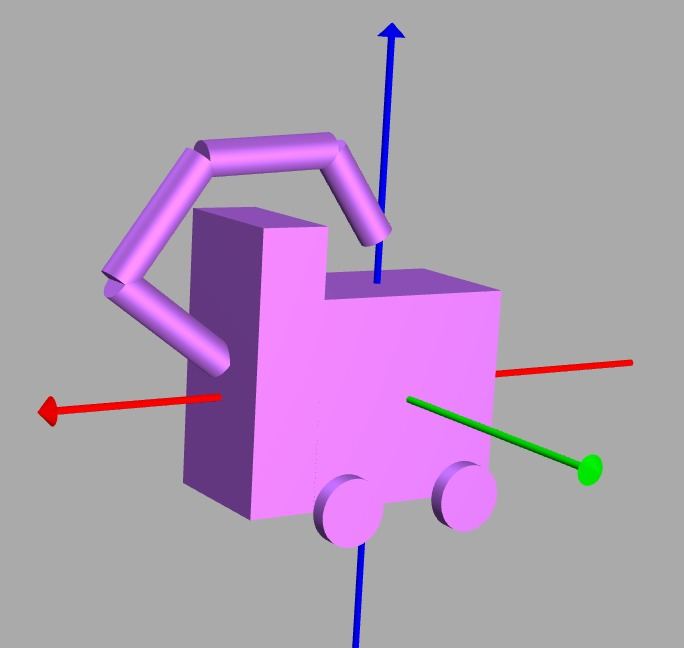

# **Wash-o-bot:** Aplicação do robô

Trabalho de Interação Humano-Robô (IHR) apresentado ao Centro Universitário [FEI](https://portal.fei.edu.br/), como parte dos requisitos necessários para aprovação na disciplina de Interação Humano-Robô (IHR) (CCR230) do curso de Engenharia de Robôs, orientado pelo Prof. Dr. [Fagner de Assis Moura Pimentel](https://github.com/fagnerpimentel).

## Componentes do Grupo

- Henrique Luisi Fernandes Pinto 11.221.068-7
- Francisco Ribeiro Silva Lima   11.120.479-8 
- Igor Croce Holanda             11.221.001-8

## Resumo
Wash-o-Bot é um robô doméstico autônomo capaz de coletar roupas, separá-las por tipo e cor, realizar o processo completo de lavagem e secagem, e organizar as peças ao final do ciclo.

## Introdução

A rotina doméstica demanda tempo e organização, sendo a lavagem de roupas uma tarefa recorrente e muitas vezes negligenciada por aqueles que possuem rotinas corridas. O Wash-o-Bot foi projetado para automatizar completamente o processo de cuidado com roupas, desde a coleta até a finalização.

Objetivo do robô: Automatizar integralmente o processo de lavagem de roupas de forma eficiente, intuitiva e confiável.
O robô deve proporcionar uma experiência prática, confiável e simples, exigindo mínima intervenção do usuário.

## Publico Alvo

Usuários domésticos que buscam otimizar tempo e reduzir esforço em tarefas domésticas.

Adultos com rotina intensa de trabalho

Idosos

Pessoas com mobilidade reduzida

### Personas

### Persona Primária: Adulto com rotina intensa

Idade: 25–45 anos

Trabalha em período integral

Mora sozinho ou com família pequena

Valoriza praticidade e tecnologia

### Informações necessárias:

Frequência de lavagem

Preferências de lavagem (tons escuros, pesado, cores separadas)

Horários para operação

### Persona Primária 2: Pessoas com Mobilidade Reduzida

Pode possuir limitações motoras permanentes ou temporárias

Necessita minimizar esforço físico

### Informações necessárias:

Nível de autonomia desejado

Configuração de comandos por voz ou aplicativo

Horários para operação

Preferência de lavagem

### Persona Secundária: Pessoa idosa

Idade: 60+

Pode ter limitações físicas

Busca autonomia dentro de casa

### Informações necessárias:

Sensibilidade a ruídos

Complexidade da interface

Preferências de lavagem (tons escuros, pesado, cores separadas)

Horários para operação

### Mapa de empatia - Persona Primaria - Adulto de Rotina Intensa

### Mapa de empatia - Persona Secundaria - Idosos

## Contexto de uso

O Wash-o-Bot opera em ambientes domésticos, como casas e apartamentos, principalmente em quartos, banheiros e áreas de lavanderia.
O robô interage com o usuário durante tarefas rotineiras do dia a dia, em um ambiente onde roupas podem estar espalhadas ou acumuladas em cestos.

### Contexto social, econômico e cultural

Rotinas cada vez mais ocupadas, com pouco tempo para tarefas domésticas.
Crescente adoção de tecnologias de automação residencial.
Interesse por soluções que aumentem conforto e produtividade em casa.

### Informações que o robô precisa saber sobre o ambiente
- Localização da lavanderia ou máquina de lavar.
- Áreas da casa onde roupas podem estar (quarto, banheiro, cesto).
- Obstáculos no ambiente (móveis, escadas, objetos no chão).
- Tipos de superfície para navegação (piso, tapete).

## Jornada do usuário

Depois de um dia corrido, ao chegar em casa, o usuário percebe que há roupas acumuladas no quarto ou na lavanderia. Para evitar realizar a tarefa manualmente, ele ativa o Wash-o-Bot por comando de voz ou aplicativo no celular, solicitando o início da lavagem. O robô confirma o comando por meio de um sinal (sonoro ou visual).
Em seguida, o Wash-o-Bot se desloca pela casa utilizando seus sensores para localizar e coletar roupas no chão ou em cestos. Durante esse processo, o robô separa as peças de acordo com características como cor ou tipo de tecido. Depois de coletar as roupas, ele se dirige à lavanderia e inicia automaticamente o ciclo de lavagem. Após a lavagem, o robô realiza a secagem das roupas e organiza as peças em um local previamente definido pelo usuário. Ao final do processo, o Wash-o-Bot envia uma notificação informando que a tarefa foi concluída, encerrando a interação com o usuário.

# Análise de concorrência

## Samsung Bot Handy

### Pontos positivos

- Capacidade de manipular objetos domésticos.
  
- Uso de visão computacional.
  
- Integração com casa inteligente.
  
- Braço robótico com seis graus de liberdade

### Pontos negativos

- Ainda em desenvolvimento.

- Alto custo esperado.

## FoldiMate - Fora do Mercado em 2021

### Pontos positivos
- Automatiza a etapa de dobrar roupas.

- Reduz o tempo gasto após a lavagem.

### Pontos negativos

- Não coleta nem lava roupas.

- Muito manual em comparação ao Wash-o-Bot.

- Retirado do mercado por baixa lucratividade

## Laundroid - Seven Dreamers - Fora do Mercado em 2021

### Pontos positivos

- Uso de inteligência artificial para reconhecer roupas.

- Automatiza a organização das peças.

## Pontos negativos

- Equipamento grande e caro.

- Não realiza coleta ou lavagem completa.

- Requer manuseio humano

## Comparação com o Wash-o-Bot

Existem soluções que automatizam partes do processo de lavanderia, mas poucas realizam todo o fluxo de forma autônoma. O Wash-o-Bot se diferencia por integrar:

- coleta de roupas

- separação automática

- lavagem

- secagem

- organização final

## Design

O Wash-o-Bot foi projetado para possuir affordances claras, permitindo que o usuário compreenda facilmente como interagir com o robô. Entre essas características estão comandos simples por voz ou aplicativo, indicadores luminosos para mostrar o estado da tarefa e compartimentos de fácil acesso para manipulação de roupas, além do braço com seis graus de liberdade.

Em relação à acessibilidade, o robô deve considerar usuários com diferentes necessidades, incluindo pessoas idosas ou com mobilidade reduzida. Para isso, o sistema deve possuir interface simples, comandos intuitivos, feedback visual ou sonoro, além de minimizar a necessidade de esforço físico.

O Wash-o-Bot possui baixo nível de características antropomórficas, focando mais em funcionalidade do que em aparência humana, com a única característica similar sendo o braço.

Esse padrão tende a ser mais aceito em robôs domésticos voltados para tarefas utilitárias, pois transmite eficiência e evita expectativas irreais sobre comportamento humanoide.

<!--  -->

## Interações do robô
### Espacial

#### Interação 1 – Aproximação do usuário

- **Descrição da interação**

O Wash-o-Bot se aproxima do usuário quando precisa iniciar uma interação direta, como confirmar o início de uma tarefa ou solicitar informações adicionais.  
A aproximação respeita princípios de proxêmica, mantendo uma distância confortável para o usuário (espaço social ou pessoal), evitando invasão do espaço íntimo.

- **Pré-requisitos**

O robô deve:
- Detectar a presença do usuário por meio de sensores ou visão computacional.
- Estimar sua posição no ambiente utilizando técnicas de localização.
- Garantir que o caminho até o usuário esteja livre de obstáculos.

- **Resposta emocional esperada**

O usuário deve sentir que o robô se aproxima de forma natural e respeitosa, transmitindo segurança e conforto, sem causar sensação de invasão de espaço pessoal.

---

#### Interação 2 – Navegação pelo ambiente doméstico

- **Descrição da interação**

Durante a coleta de roupas ou deslocamento entre cômodos, o Wash-o-Bot navega pelo ambiente doméstico evitando obstáculos como móveis, paredes e objetos no chão.  
Além disso, o robô considera a presença de pessoas no ambiente, ajustando sua trajetória para não interromper atividades humanas.

- **Pré-requisitos**

O robô deve:
- Possuir mapa do ambiente doméstico.
- Utilizar sensores para detectar obstáculos estáticos e dinâmicos.
- Executar planejamento de trajetória para deslocamento entre pontos da casa.

- **Resposta emocional esperada**

O usuário deve perceber o robô como seguro e previsível, confiando que ele não irá colidir com objetos ou pessoas.

---

#### Interação 3 – Navegação socialmente apropriada

- **Descrição da interação**

Quando pessoas estão presentes, o Wash-o-Bot adapta sua navegação para não interromper interações humanas ou atividades do usuário, como conversar com outra pessoa ou utilizar objetos do ambiente.

- **Pré-requisitos**

O robô deve:
- Detectar pessoas no ambiente.
- Identificar áreas de interação humana.
- Ajustar sua rota para contornar grupos de pessoas ou zonas de interação.

- **Resposta emocional esperada**

Os usuários devem perceber o robô como educado e respeitoso, evitando a sensação de que o robô está “atrapalhando” a interação humana.

---

#### Interação 4 – Posicionamento durante a coleta de roupas

- **Descrição da interação**

Ao coletar roupas no chão ou em cestos, o Wash-o-Bot posiciona-se próximo ao objeto mantendo distância adequada do usuário e dos móveis ao redor.  
Esse posicionamento garante que o robô execute a tarefa sem bloquear passagens ou incomodar o usuário.

- **Pré-requisitos**

O robô deve:
- Identificar a posição das roupas no ambiente.
- Calcular uma posição adequada para manipulação do objeto.
- Manter distância segura de pessoas e objetos.

- **Resposta emocional esperada**

O usuário deve perceber o robô como eficiente e organizado, executando a tarefa de forma clara e sem causar desconforto no ambiente doméstico.

---

## Verbal
**O robo deve ter um tom tranquilo e agradável, respondendo de forma direta mas sempre buscando a complitude da informação para não cometer erros**

#### Interação 1 – Ativação do robô por comando de voz
- Usuário: "Wash-o-Bot, pode começar a lavar minhas roupas?"
- Robô: "Entendido. Deseja que eu inicie a coleta de roupas agora?"
- Usuário: "Wash-o-Bot, começar a lavar roupas"
- Robô: "Não entendi. Deseja que eu inicie a coleta de roupas agora?"
- Usuario: "Sim!"
- Robô: "Entendido! Iniciando coleta de roupas"

---

#### Interação 2 – Confirmação de preferências de lavagem
- Robô: "Identifiquei roupas claras e escuras. Deseja separar por cor?"
- Usuário: "Sim."
- Robô: "Perfeito. Deseja lavagem delicada para peças sensíveis?"
- Usuário: "Não."
- Robô: "Entendido. Vou separar por cor e usar o ciclo padrão."

---

#### Interação 3 – Identificação de lavagem
- Usuário: "Lave roupas de seda.  "
- Robô: "Entendido. Vou selecionar lavagem delicada para roupas de seda. Deseja usar água fria e baixa rotação?"
- Usuário: "Sim."  
- Robô: "Perfeito. Iniciando lavagem delicada para roupas de seda."

---

#### Interação 4 – Higienização da máquina
- Usuário: "Faça a higienização da máquina."
- Robô: "Entendido. Deseja que eu inicie a higienização da máquina agora?"
- Usuário: "Sim."
- Robô: "Perfeito. Iniciando a higienização da máquina."

---

#### Interação 5 – Separação de tecidos
- Usuário: "Separe as roupas por tecido."
- Robô: "Entendido. Vou organizar as peças por tipo de tecido antes da lavagem. Deseja priorizar tecidos delicados?"
- Usuário: "Sim."
- Robô: "Perfeito. Vou separar primeiro os tecidos delicados."

---

#### Interação 6 – Separação por cores
- Usuário: "Pegue roupas claras."
- Robô:" Entendido. Vou coletar e separar as roupas claras primeiro. Deseja lavar as escuras depois?"
- Usuário:" Sim."
- Robô: "Perfeito. Vou começar pelas roupas claras."

---

#### Interação 7 – Processo de secagem
- Usuário: "Pode iniciar a secagem."
- Robô: "Entendido. Vou iniciar o processo de secagem das roupas. Deseja secagem completa ou modo delicado?"
- Usuário: "Secagem completa."
- Robô: "Perfeito. Iniciando secagem completa."

---

#### Interação 8 – Encerramento cordial de contato
- Robô: "O processo foi concluído com sucesso. Suas roupas já estão lavadas, secas e organizadas."
- Usuário: "Obrigado."
- Robô: "De nada. Estou à disposição para a próxima tarefa".

### Não-verbal

- Para cada interação:
  - Descreva a interação.
  - Determine os pré-requisitos para que a interação aconteça
  - Determine espera de resposta emocional do usúario quando a interação é finalizada

[^1]: Fonte: Adaptado de <https://hazeshift.com.br/mapa-de-empatia/>

<!-- TODOs:
- Add exemplos
 -->
