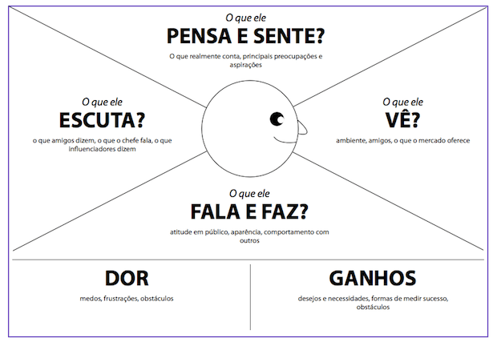
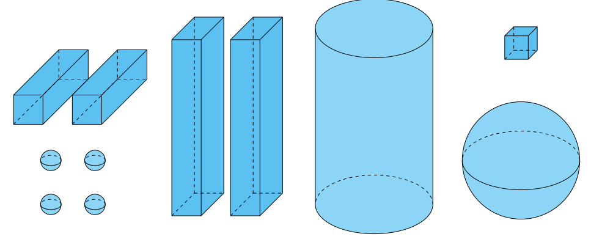
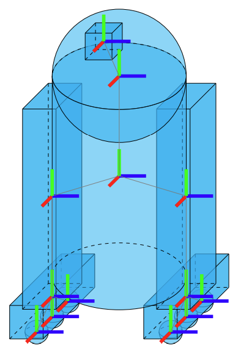

# **Wash-o-bot:** Aplicação do robô

Trabalho de Interação Humano-Robô (IHR) apresentado ao Centro Universitário [FEI](https://portal.fei.edu.br/), como parte dos requisitos necessários para aprovação na disciplina de Interação Humano-Robô (IHR) (CCR230) do curso de Engenharia de Robôs, orientado pelo Prof. Dr. [Fagner de Assis Moura Pimentel](https://github.com/fagnerpimentel).

## Componentes do Grupo

- Henrique Luisi Fernandes Pinto 11.221.068-7
- Francisco Ribeiro Silva Lima   11.120.479-8 
- Igor Croce Holanda             11.221.001-8

## Resumo
Wash-o-Bot é um robô doméstico autônomo capaz de coletar roupas, separá-las por tipo e cor, realizar o processo completo de lavagem e secagem, e organizar as peças ao final do ciclo.

## Introdução

A rotina doméstica demanda tempo e organização, sendo a lavagem de roupas uma tarefa recorrente e muitas vezes negligenciada por aqueles que possuem rotinas corridas. O Wash-o-Bot foi projetado para automatizar completamente o processo de cuidado com roupas, desde a coleta até a finalização.

Objetivo do robô: Automatizar integralmente o processo de lavagem de roupas de forma eficiente, intuitiva e confiável.
O robô deve proporcionar uma experiência prática, confiável e simples, exigindo mínima intervenção do usuário.

## Publico Alvo

Usuários domésticos que buscam otimizar tempo e reduzir esforço em tarefas domésticas.

Adultos com rotina intensa de trabalho
Idosos
Pessoas com mobilidade reduzida

### Personas

## Persona Primária: Adulto com rotina intensa
Idade: 25–45 anos
Trabalha em período integral
Mora sozinho ou com família pequena
Valoriza praticidade e tecnologia

# Informações necessárias:
Frequência de lavagem
Preferências de lavagem (tons escuros, pesado, cores separadas)
Horários para operação

## Persona Secundária: Pessoas com Mobilidade Reduzida
Pode possuir limitações motoras permanentes ou temporárias
Necessita minimizar esforço físico

# Informações necessárias:
Nível de autonomia desejado
Configuração de comandos por voz ou aplicativo
Horários para operação
Preferência de lavagem

## Persona Terciária: Pessoa idosa
Idade: 60+
Pode ter limitações físicas
Busca autonomia dentro de casa

# Informações necessárias:
Sensibilidade a ruídos
Complexidade da interface
Preferências de lavagem (tons escuros, pesado, cores separadas)
Horários para operação

### Mapa de empatia

- Determine o mapa de empatia[^1] de pelo menos uma persona primária e uma sercundária.
  - O que o usuário vê: aqui estamos falando do ambiente visual em que o usuário se encontra. Ou seja, o que ele efetivamente enxerga, as pessoas e objetos que estão ao seu redor. Isso ajuda a entender o contexto em que o usuário está inserido e as influências visuais que está recebendo.
  - O que o usuário ouve: neste quadrante, buscamos entender o que o usuário está ouvindo, os sons que o cercam e como eles influenciam suas ações.
  - O que o usuário diz e faz: aqui consideramos ações e comportamentos que o usuário apresenta durante sua interação com o robô.
  - O que o usuário pensa e sente: neste quadrante, buscamos entender os pensamentos, sentimentos, emoções e percepções que o usuário tem em relação robô. Quais expectativas o usuário cria sobre o robô?
  Que tipo de robô mais agrada essa persona?
  - Dores: quando falamos sobre dores do usuário, estamos fazendo referência a quaisquer obstáculos, necessidades ou frustrações que o usuário possa experimentar ao tentar realizar uma tarefa ou alcançar um objetivo. Isso inclui, por exemplo, problemas de usabilidade, dificuldades de acesso ou outros desafios que podem afetar a experiência do usuário.
  - Ganhos: nesse caso estamos falando de quaisquer benefícios ou recompensas que o usuário possa experimentar ao utilizar o robô. Isso pode incluir economia de tempo ou facilidade de uso, por exemplo. Que desejos do usuário o robô satisfaz?

## Contexto de uso

- Descreva o ambiente em que o robô interage com os usuários
- Qual/quais o(s) contexto(s) sociais, econômicos e culturais existentes neste ambiente?
- Quais informações sobre o ambiente o robô deve saber antes de iniciar a tarefa?

## Jornada do usuário

- Criar uma narrativa para o o seu robô e o usuário.
- Determine o passo a passo que o usuário realiza desde o primeiro até o último encontro com robô na realização da tarefa.
- O que está acontecendo com o ambiente quando o robô está interagindo com o usuário?
  - Descreva o que acontece ou pode acontecer passo a passo
  - Como a tarefa começa? Como a tarefa evolui? Como a tarefa termina?
- Enfatize todos os momentos em que acontece uma interação verbal, não-verbal e espacial.

## Análise de concorrência

- Pesquise robôs existentes atualmente que possam fazer a tarefa deste projeto.
- Selecione pelo menos 3 robôs diferentes que podem fazer essa tarefa.
- Em relação aos concorrentes, respondam as seguintes perguntas?
  - Existe plataforma similar que atende o mesmo mercado e funcionalidades? Se sim: Quais os pontos positivos? Quais os pontos negativos?
  - Existe plataforma diferente quanto ao serviço, mas que atenda esse mercado? Se sim: Quais os pontos positivos? Quais os pontos negativos?
  - Quais plataformas sua equipe acha mais interessantes? Qual a justificativa?

## Design

- Pense nas características de Affordances do seu robô. Que tipo de acessibilidades devem ser consideradas dentro do seu projeto?
- Discuta o papel das expectativas do usuário no projeto de um robô. Qual a importância e pontos a serem considerados se você quiser vender esse robô  seu robô?
- O seu robô tem um padrão com mais ou menos características antropomórficas? Qual padrão é mais aceito pela sociedade dentro do projeto que você está desenvolvendo?
- Quais o design mais apropriado para o robô deste projeto? Modele o seu robô com desenhos de formas primitivas (caixas, cilindros, esferas)

<!--  -->
<!--  -->

## Ações do robô

- Para cada ação:
  - Descreva a ação.
  - Determine os pré-requisitos para que a ação aconteça
  - Determine o que se espera que seja modificado no ambiente quando a ação é finalizada

## Interações do robô

### Espacial

- Para cada interação:
  - Descreva a interação.
  - Determine os pré-requisitos para que a interação aconteça
  - Determine espera de resposta emocional do usúario quando a interação é finalizada

### Verbal

- Para cada interação:
  - Descreva a interação.
  - Determine os pré-requisitos para que a interação aconteça
  - Determine espera de resposta emocional do usúario quando a interação é finalizada

### Não-verbal

- Para cada interação:
  - Descreva a interação.
  - Determine os pré-requisitos para que a interação aconteça
  - Determine espera de resposta emocional do usúario quando a interação é finalizada

[^1]: Fonte: Adaptado de <https://hazeshift.com.br/mapa-de-empatia/>

<!-- TODOs:
- Add exemplos
 -->
